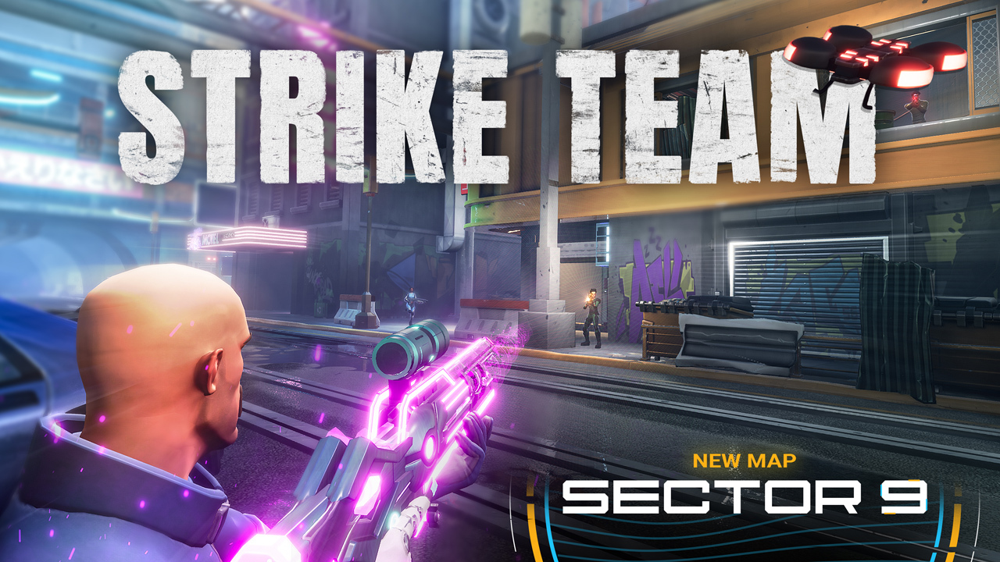

# Strike Team - Sector 9

In this fast-paced FPS, two teams compete for control of Strike Points on the futuristic and dystopian battlefield - Sector 9. Navigate the cityscape, control the rooftops, take down snipers, and fight your way through hails of gunfire and grenades. Earn experience and level up to unlock passive abilities. Use in-game cash rewards to unlock weapon choices. And watch out for the trolley!

Note: Progress on Strike Team: Sector 9 is shared with the original Strike Team game.

## Project Structure

Strike Team - Sector 9 consists of 3 games, each of those are in their respective top level folder of the project:

- NewSniperAlley, the main game.
- Portal Images
- Loadout

## Disclaimer

This project is being released as-is and targetted towards more advanced users. It does not reflect current best practices nor is it perfectly optimized, please keep that in mind.

## Credits

Strike Team - Sector 9 was created via the hard work of these Core creators:

- META Director: Buckmonster
- Design Leads: Buckmonster, Bigglebuns
- Inspiration, Design, Last Minute Changes: Basilisk
- Producer: Rolok
- Associate Producer: Jarsa
- Technical Lead: Standardcombo
- Lead Developer: Blaking707, Morticai
- Support Developer: Estlogic, Divide
- Map design and creation: Keppu, KidEgg, mjcortes782
- UI design and art: KonzZwodrei
- Lead Weapon artist: Mucusinator
- Sound & Music: Deadlyfishes
- Test Lead: AJ
- Props: mjcortes782
- Additional Art, UI: WitcherSilver
- Amazing Skins: Aggripina, AwkwardGameDev, Melamoryxq, mjcortes782, Mucusinator

## CC Components

- NicholasForeman (EaseUI)
- Standardcombo (Teleportation Network)

## Feedback & Support

Please use GitHub issues or our [thread on the Core Forums](https://forums.coregames.com/t/strike-team-sector-9/1615) for feedback and support.

## Contributing

If you are interested in fixing issues and contributing directly to the code base, please see our [contributing guidelines](CONTRIBUTING.md).

## License

Licensed under the [Apache License 2.0](LICENSE) license.
